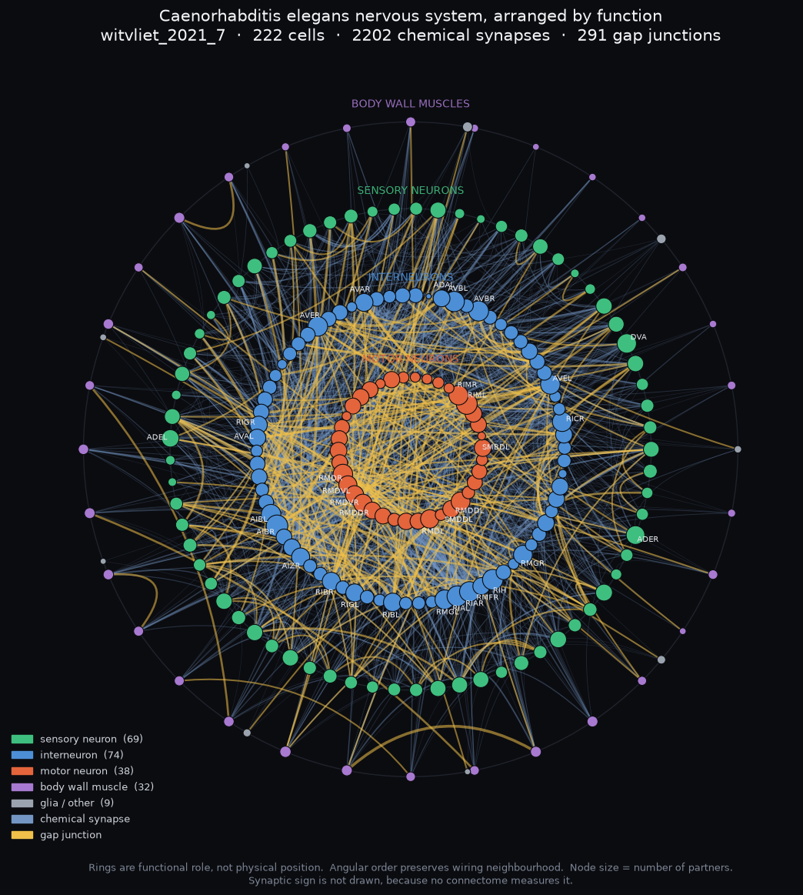
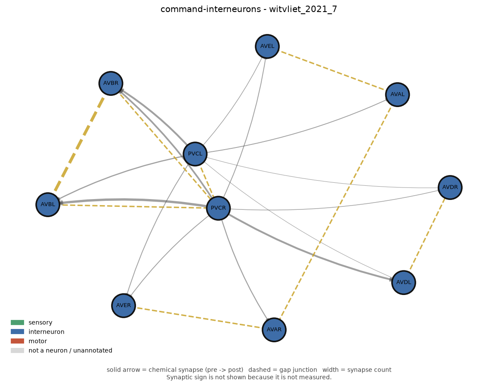

# isaac-bioresearch

[](https://github.com/BacheyG/isaac-bioresearch-playground/actions/workflows/ci.yml)
[](LICENSE)
[](DATA_LICENSES.md)
[](pyproject.toml)

**Embodied, biologically derived nervous systems in NVIDIA Isaac Sim.**

Isaac Sim normally gives artificial agents a virtual world to act in. This
project asks a different question:

> What happens if the controller is not designed, but derived from the nervous
> system of a real biological animal?

Two organisms, in order:

1. **_C. elegans_** — 302 neurons, completely reconstructed. Small enough to
   prove the entire embodied sensorimotor loop end to end.
2. **_Drosophila melanogaster_** — ~140,000 neurons. Richer perception, richer
   behaviour, and a far harder engineering problem.

The target is a genuinely closed loop:

```
sensory input -> neural dynamics -> motor output -> body -> environment -> sensory input
```

with nothing allowed to short-circuit the middle. If the worm turns toward food,
it has to be because a sensory neuron fired and the signal propagated — not
because a controller was handed the food's coordinates.

---

## Status

**Milestone W0 complete: the *C. elegans* data foundation.**

Built and verified:

- Importer for all eight [Witvliet et al. 2021](https://doi.org/10.1038/s41586-021-03778-8)
  individual brain connectomes, with our own normalized schema.
- Every dataset's totals checked against independently published figures —
  8 datasets × 8 fields, all agreeing.
- Annotation overlays (functional role, neurotransmitter, neuron class), each
  citing its own source per field.
- Inspection CLI, circuit visualizer, and a generated
  [reference for all 302 neurons](docs/neurons.md).
- 170 tests, running offline on a fresh clone.

**Not built yet, deliberately:** neural dynamics, any body, any Isaac Sim
integration, anything fly-related. Two biological decisions must be settled first
— see [model_assumptions.md §6](docs/model_assumptions.md#6-open-decisions-before-w1).

---

## What this actually contains

Run this to see the project's central discipline in action:

```
python tools/inspect_connectome.py --dataset witvliet_2021_7 gaps
```

```
MEASURED by witvliet_2021_7:
  cell presence, connection presence, synapse type, synapse count

NOT MEASURED - supplied by other sources:
  cell.category            222   wormatlas_cook_2019_via_cect   WormAtlas cell listings...
  cell.roles               181   wormatlas_cook_2019_via_cect   WormAtlas cell listings...
  cell.class_name          181   wang_2024_nt_atlas             Wang C, Vidal B, Sural S...
  cell.neurotransmitters   181   wang_2024_nt_atlas             Wang C, Vidal B, Sural S...

NOT AVAILABLE AT ALL - no source in this repository provides these:
  - synaptic sign (excitatory / inhibitory)
  - synaptic strength / conductance
  - the animal's neural activity, or anything it had learned
  - extrasynaptic signalling (neuropeptides, monoamines)
```

An electron-microscopy connectome measures four things. Everything else in a
loaded graph arrived from a different experiment, and says so — per field, with a
citation. That is enforced by the type system and the test suite, not by good
intentions.

Two findings from building it that changed the design:

- **Witvliet #7 cannot make a worm crawl.** It is a *brain* reconstruction: no
  ventral-cord motor neurons, and only the front eight body-wall muscle segments.
  The circuitry that generates the crawling gait is not in the file. Recorded in
  the data as `Scope.HEAD` so downstream code can refuse rather than silently
  produce a paralysed worm.
- **No connectome contains synaptic sign.** Electron microscopy shows a synapse
  exists; it cannot show which receptor sits on the other side, and that receptor
  decides whether the synapse excites or inhibits. Sign can only be *predicted*.
  So no polarity overlay is applied by default, and `validate()` rejects any
  connection claiming a measured sign.

---

## Quickstart

Requires Python 3.12+.

```bash
python -m venv .venv
.venv/Scripts/python -m pip install -e ".[dev,viz]"      # Windows
# .venv/bin/python -m pip install -e ".[dev,viz]"        # macOS / Linux

# the committed data works offline; run the tests immediately
.venv/Scripts/python -m pytest

# explore
.venv/Scripts/python tools/inspect_connectome.py list
.venv/Scripts/python tools/inspect_connectome.py --dataset witvliet_2021_7 summary
.venv/Scripts/python tools/inspect_connectome.py --dataset witvliet_2021_7 cell ASHL
.venv/Scripts/python tools/inspect_connectome.py --dataset witvliet_2021_7 verify
.venv/Scripts/python tools/inspect_connectome.py compare witvliet_2021_7 witvliet_2021_8

# draw a circuit
.venv/Scripts/python tools/visualize_connectome.py --list-circuits
.venv/Scripts/python tools/visualize_connectome.py --circuit gentle-touch --hops 1 -o out.png
```

To rebuild the derived data from the published sources (not required to use it):

```bash
.venv/Scripts/python tools/fetch_datasets.py --organism worm --all
.venv/Scripts/python tools/build_datasets.py --organism worm
git diff --stat worm/data/normalized      # should be empty
```

### What one worm's nervous system looks like

```bash
python tools/visualize_connectome.py --whole -o whole.png
```



Rings are functional role — motor innermost, out through interneurons and sensory
neurons to body wall muscle. *Angular* position comes from a force layout of the real
graph, so neighbours on a ring are wiring neighbours. Gold is gap junctions: note how
they concentrate among the motor neurons and reach straight out to muscle, which is how
the animal keeps muscle groups in lockstep. Nothing is coloured by excitation or
inhibition, because that genuinely is not in the data.

Or a single circuit, with citations, from `worm/data/circuits/circuits.json`:

```bash
python tools/visualize_connectome.py --circuit command-interneurons -o circuit.png
```



---

## Using it as a library

```python
from worm.loader import load

connectome, coverage = load("witvliet_2021_7")

print(connectome.totals())
print(connectome.cell("ASHL").roles)              # (SIMRole.SENSORY,)
print(connectome.cell("ASHL").neurotransmitters)  # (Neurotransmitter.GLUTAMATE,)
print(connectome.cell("ASHL").field_sources)      # who said so, per field

# a readable neighbourhood instead of a hairball
sub = connectome.subgraph(["ASHL", "ASHR"], hops=1)
```

---

## Documentation

| | |
|---|---|
| [docs/biology.md](docs/biology.md) | The biology, written for a software engineer. What a connectome is and is not; graded vs spiking; why sign is missing. |
| [docs/neurons.md](docs/neurons.md) | Every cell in the dataset: what its name stands for, what it does, its neurotransmitter and how heavily it is wired. Generated from data. |
| [docs/model_assumptions.md](docs/model_assumptions.md) | **The central document.** Every departure from measured biology, and the open decisions before W1. |
| [docs/datasets.md](docs/datasets.md) | Per-dataset factsheets, including what each one omits. |
| [docs/architecture.md](docs/architecture.md) | How the layers separate, and what is deliberately absent. |
| [docs/references.md](docs/references.md) | Every dataset and paper, with licences. |
| [CONTRIBUTING.md](CONTRIBUTING.md) | How to contribute, and the one rule: never invent biology. |
| [DATA_LICENSES.md](DATA_LICENSES.md) | Licences and attribution for the scientific data, which the MIT licence does **not** cover. |

### Wondering what `ADEL`, `DVA` or `AVAL` are?

Worm neuron names are acronyms, and each names one specific cell that exists in every
animal. `ADEL` is the **A**nterior **DE**irid neuron, **L**eft. All 302 of them,
with etymology, lineage, neurotransmitter and wiring counts, are in
[docs/neurons.md](docs/neurons.md).

---

## Scientific honesty

This repository models **anatomy**, and anatomy is not a mind.

A connectome is a wiring diagram traced from electron micrographs of one fixed,
dead animal. It contains no neural activity, no memories, nothing the animal
learned, and none of the extrasynaptic signalling that leaves no visible trace.
These are distinct things and the project keeps them distinct:

> anatomical connectome ≠ functional connectivity ≠ neural dynamics ≠
> instantaneous neural state ≠ learned state ≠ behaviour ≠ consciousness

Accurate descriptions of what is here: *biologically derived nervous-system
model*, *connectome reconstructed from a biological specimen*, *embodied
connectome*, *biologically constrained neural controller*, *closed-loop
sensorimotor simulation*.

Not accurate: *uploaded brain*, *resurrected animal*, *preserved consciousness*,
*digital organism*.

Philosophical questions about what would be needed to bridge those gaps are
genuinely interesting, and are welcome — labelled as questions.

## Licence and citation

**Code** — MIT, see [LICENSE](LICENSE).

**Data** — *not* covered by the MIT licence. Published datasets keep their own
licences, recorded per source in [`worm/data/sources.toml`](worm/data/sources.toml)
and explained in [DATA_LICENSES.md](DATA_LICENSES.md). No raw source dataset is
redistributed here; `tools/fetch_datasets.py` downloads them and verifies their
SHA-256.

**If you use this, cite the underlying data first.** The connectomes represent years
of painstaking manual reconstruction from electron micrographs; the code here is
engineering on top of them. Start with:

> Witvliet D, et al. Connectomes across development reveal principles of brain
> maturation. *Nature* 596:257–261 (2021). doi:10.1038/s41586-021-03778-8

For the software itself, see [CITATION.cff](CITATION.cff).

## Contributing

See [CONTRIBUTING.md](CONTRIBUTING.md). One rule matters more than any style
guideline: **never invent biology.** Every biological value must be traceable to a
citation, or explicitly labelled as an assumption in
[docs/model_assumptions.md](docs/model_assumptions.md). Deliberate assumptions are
fine; silent ones are not.
