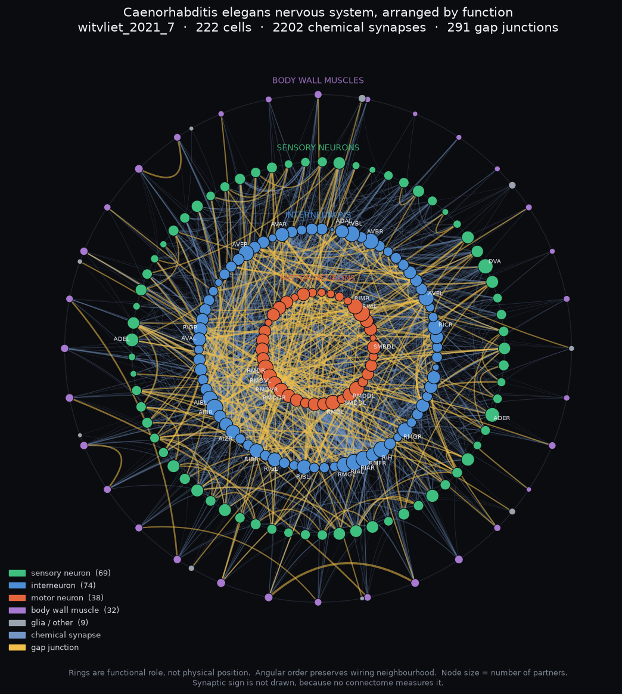
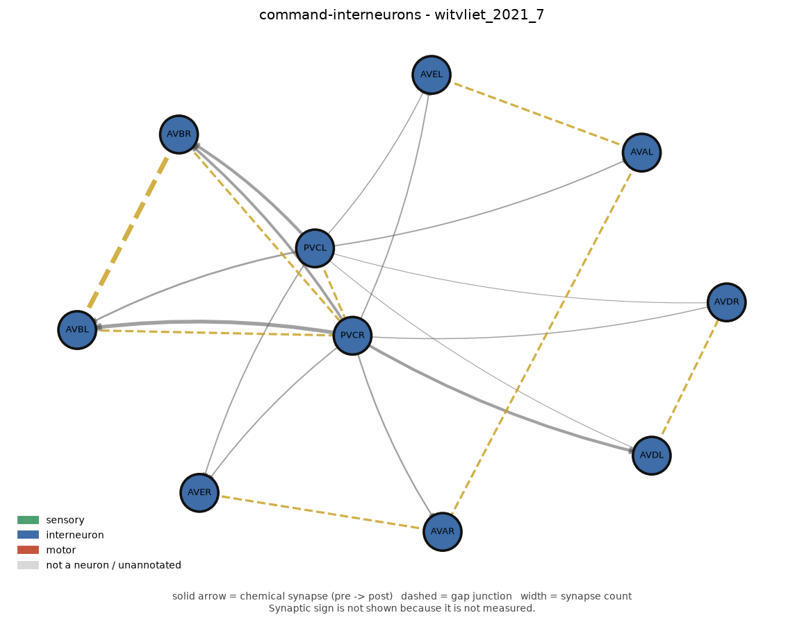

# isaac-bioresearch

[](https://github.com/BacheyG/isaac-bioresearch-playground/actions/workflows/ci.yml)
[](LICENSE)
[](DATA_LICENSES.md)
[](pyproject.toml)

**Embodied, biologically derived nervous systems in NVIDIA Isaac Sim.**

Isaac Sim normally gives artificial agents a virtual world to act in. This
project asks a different question:

> What happens if the controller is not designed, but derived from the nervous
> system of a real biological animal?

Two organisms, in order:

1. **_C. elegans_** — 302 neurons, completely reconstructed. Small enough to
   prove the entire embodied sensorimotor loop end to end.
2. **_Drosophila melanogaster_** — ~140,000 neurons. Richer perception, richer
   behaviour, and a far harder engineering problem.

The target is a genuinely closed loop:

```
sensory input -> neural dynamics -> motor output -> body -> environment -> sensory input
```

with nothing allowed to short-circuit the middle. If the worm turns toward food,
it has to be because a sensory neuron fired and the signal propagated — not
because a controller was handed the food's coordinates.

---

## Status

**Milestone W0 complete: the *C. elegans* data foundation.**

Built and verified:

- Importers for all eight [Witvliet et al. 2021](https://doi.org/10.1038/s41586-021-03778-8)
  individual brain connectomes **and** the whole-animal
  [Cook et al. 2019](https://doi.org/10.1038/s41586-019-1352-7) hermaphrodite
  connectome, in our own normalized schema.
- Every dataset's totals checked against independently published figures —
  9 datasets, 75 field comparisons, all agreeing.
- Annotation overlays (functional role, neurotransmitter, neuron class), each
  citing its own source per field.
- Inspection CLI, circuit visualizer, and a generated
  [reference for all 302 neurons](docs/neurons.md).
- 203 tests, running offline on a fresh clone.

**Not built yet, deliberately:** neural dynamics, any body, any Isaac Sim
integration, anything fly-related. Two biological decisions must be settled first
— see [model_assumptions.md §6](docs/model_assumptions.md#6-open-decisions-before-w1).

---

## What this actually contains

Run this to see the project's central discipline in action:

```
python tools/inspect_connectome.py --dataset witvliet_2021_7 gaps
```

```
MEASURED by witvliet_2021_7:
  cell presence, connection presence, synapse type, synapse count

NOT MEASURED - supplied by other sources:
  cell.category            222   wormatlas_cook_2019_via_cect   WormAtlas cell listings...
  cell.roles               181   wormatlas_cook_2019_via_cect   WormAtlas cell listings...
  cell.class_name          181   wang_2024_nt_atlas             Wang C, Vidal B, Sural S...
  cell.neurotransmitters   181   wang_2024_nt_atlas             Wang C, Vidal B, Sural S...

NOT AVAILABLE AT ALL - no source in this repository provides these:
  - synaptic sign (excitatory / inhibitory)
  - synaptic strength / conductance
  - the animal's neural activity, or anything it had learned
  - extrasynaptic signalling (neuropeptides, monoamines)
```

An electron-microscopy connectome measures four things. Everything else in a
loaded graph arrived from a different experiment, and says so — per field, with a
citation. That is enforced by the type system and the test suite, not by good
intentions.

Two findings from building it that changed the design:

- **Witvliet #7 cannot make a worm crawl.** It is a *brain* reconstruction: no
  ventral-cord motor neurons, and only the front eight body-wall muscle segments.
  The circuitry that generates the crawling gait is not in the file. Recorded in
  the data as `Scope.HEAD` so downstream code can refuse rather than silently
  produce a paralysed worm — which is why the whole-animal Cook 2019 dataset is
  imported alongside it.
- **No connectome contains synaptic sign.** Electron microscopy shows a synapse
  exists; it cannot show which receptor sits on the other side, and that receptor
  decides whether the synapse excites or inhibits. Sign can only be *predicted*.
  So no polarity overlay is applied by default, and `validate()` rejects any
  connection claiming a measured sign.

---

## Quickstart

Requires Python 3.12+.

```bash
python -m venv .venv
.venv/Scripts/python -m pip install -e ".[dev,viz]"      # Windows
# .venv/bin/python -m pip install -e ".[dev,viz]"        # macOS / Linux

# the committed data works offline; run the tests immediately
.venv/Scripts/python -m pytest

# explore
.venv/Scripts/python tools/inspect_connectome.py list
.venv/Scripts/python tools/inspect_connectome.py --dataset witvliet_2021_7 summary
.venv/Scripts/python tools/inspect_connectome.py --dataset witvliet_2021_7 cell ASHL
.venv/Scripts/python tools/inspect_connectome.py --dataset witvliet_2021_7 verify
.venv/Scripts/python tools/inspect_connectome.py compare witvliet_2021_7 witvliet_2021_8

# draw a circuit
.venv/Scripts/python tools/visualize_connectome.py --list-circuits
.venv/Scripts/python tools/visualize_connectome.py --circuit gentle-touch --hops 1 -o out.png
```

To rebuild the derived data from the published sources (not required to use it):

```bash
.venv/Scripts/python tools/fetch_datasets.py --organism worm --all
.venv/Scripts/python tools/build_datasets.py --organism worm
git diff --stat worm/data/normalized      # should be empty
```

### What one worm's nervous system looks like

```bash
python tools/visualize_connectome.py --whole -o whole.png
```



Rings are functional role — motor innermost, out through interneurons and sensory
neurons to body wall muscle. *Angular* position comes from a force layout of the real
graph, so neighbours on a ring are wiring neighbours. Gold is gap junctions: note how
they concentrate among the motor neurons and reach straight out to muscle, which is how
the animal keeps muscle groups in lockstep. Nothing is coloured by excitation or
inhibition, because that genuinely is not in the data.

Or a single circuit, with citations, from `worm/data/circuits/circuits.json`:

```bash
python tools/visualize_connectome.py --circuit command-interneurons -o circuit.png
```



---

## Running the simulation

Every command below is copy-pasteable. Isaac Sim is launched through its own
Python, not the project venv.

### Watch the worm

```powershell
C:\isaacsim\python.bat worm\isaac\run_connectome.py --seconds 120 --physics-hz 240 --quasistatic
```

The connectome drives the body: body curvature into the B-type motor neurons,
302 coupled ODEs, muscle activation, joint torque, movement, back to curvature.
No scripted wave anywhere.

`--quasistatic` solves the body's force balance instead of integrating its
momentum, and it is on every command here because a worm on agar is overdamped
enough that the inertial solver's travel depends on the timestep: the same gait
covers 7.216 BL at 240 Hz and 1.442 BL at 60 Hz, where the quasi-static body
agrees with itself to 5%. See
[`model_assumptions.md`](docs/model_assumptions.md) §5AE and §5AF.

Windowed runs default to 60 Hz physics so a cycle takes ~45 s of wall clock
rather than ~3 minutes. **Do not quote numbers from a windowed run** -- pass
`--physics-hz 240` for anything measured, and see
[`model_assumptions.md`](docs/model_assumptions.md) §5Y for why.

What to expect: **it crawls forward**, about 8.6 body lengths in two minutes on
a 3.2 s rhythm, along a gently curving path (under a degree a second), the body
never touching itself. That is the committed model since
[`model_assumptions.md`](docs/model_assumptions.md) §5AO.5–5AO.6: the muscle cells
coupled to each other at the ratio Liu et al. 2006 measured, proprioception that
is 70% rate-sensing and 30% tonic, under half the old muscle torque, and
self-collision on. On the slow side -- 0.07 to 0.09 BL/s against a real animal's
0.1--0.3 -- and two of those four changes are assumptions; the section below has
the faster variants and what each change rests on.

Until §5AO.5 the same command did **not** crawl:
the animal coiled and tumbled, its wave travelling the wrong way. That model is
still there, and every result measured on it before §5AO.5 reproduces with
`--legacy-defaults`:

```powershell
C:\isaacsim\python.bat worm\isaac\run_connectome.py --seconds 180 --legacy-defaults --torque-scale 3e-3 --quasistatic
```

Why it failed and how it was fixed is
[`negative_result.md`](docs/negative_result.md) and §5AN of
[`model_assumptions.md`](docs/model_assumptions.md).

### The connectome crawling forward

```powershell
C:\isaacsim\python.bat worm\isaac\run_connectome.py --seconds 120 --physics-hz 240 --quasistatic --torque-scale 1e-3 --proprio-rate 1.0 --param g_gap_ps=5
```

The same loop, with proprioception that senses the *rate* of bending rather than
the bend, a higher proprioceptive gain, gap junctions twenty times weaker than
committed, and a third of the committed muscle torque. It produces a
forward-travelling wave at 2.1 s -- the real animal's frequency -- with
neighbouring B-type motor neurons alternating (adjacent correlation −0.40), and
carries the body **16 body lengths in two minutes, nearly straight, at
0.15 BL/s**, with the body unable to pass through itself and never touching
itself. Nothing scripts the rhythm, the phase gradient or the direction. Cut the
proprioception, or silence the B-type motor neurons, and it does not move.

Every one of those changes is assumed, but two of them can be brought closer to
measurement. Body-wall muscle cells are coupled to each other far more weakly than
the model's uniform gap-junction strength made them (Liu et al. 2006), and B-type
proprioception responds to a held bend, so it cannot be purely rate-sensing (Wen
et al. 2012). With only the muscle coupling set to its measured ratio, the
neurons' gap junctions as committed, and 30% of the proprioceptive signal tonic,
it still crawls forward, more slowly. That version, with the torque refined in
§5AO.6, is now the committed default: the plain command under *Watch the worm*
runs it.

The neurons' own gap junctions are a third lever. Their committed strength,
100 pS, is itself an assumption (Kunert et al. 2014), and at half of it the
default model crawls at **0.11 BL/s** -- inside the real animal's range -- with a
wave of −21° per joint against the real −23°, on a 2.6 s rhythm, along a gently
curving path -- 11.3 body lengths in two minutes in Isaac:

```powershell
C:\isaacsim\python.bat worm\isaac\run_connectome.py --seconds 120 --physics-hz 240 --quasistatic --torque-scale 1e-3 --gap-scale neuron=0.5
```

It is not the default because that conductance sets every neural result in this
project, not only the gait, and changing it is a decision rather than a tuning
step; §5AO.6 has the case for it.

An earlier version of this section used the committed torque without
`--self-collision`; that crawl relied on the body passing through itself and is
withdrawn. How all of it was found -- eigenvalues, a phase argument, and
searches reported as searches -- is
[`model_assumptions.md`](docs/model_assumptions.md) §5AN.13–5AN.24.

### The positive control -- what a gait looks like in the same body

```powershell
C:\isaacsim\python.bat worm\isaac\run_connectome.py --seconds 180 --torque-scale 3e-3 --quasistatic --seed-wave 180
```

A scripted sinusoidal wave instead of the connectome. It crawls: **13.0 body
lengths in sixty seconds, 0.217 BL/s**, which is a real animal's speed, with a
clean head-to-tail wave and a slip of 0.33 against the animal's 0.1--0.3
(§5AG). The default connectome run above is about a quarter as fast; the
difference between the two is what is still missing.

Two columns in the output are worth reading as it runs. `clear` is the closest
approach between two non-neighbouring segments, so a negative value means the
body is passing through itself -- neither solver prevents that. `extent` is how
extended the body is, 1.0 straight and 0 a closed loop; the scripted gait holds
0.73; the legacy connectome model (`--legacy-defaults`) dropped to 0.17.

### Making it grip

The body slides more than a real worm: it advances two thirds of its wave speed
where a real animal manages 70--90 per cent, and because linear drag has no
threshold at all, a body holding a near-stable shape still creeps steadily
across the ground. Both are properties of the drag model. Two flags change the
force--velocity law:

```powershell
C:\isaacsim\python.bat worm\isaac\run_connectome.py --seconds 180 --torque-scale 3e-3 --quasistatic --seed-wave 180 --drag-exponent 0.6 --drag-yield 2e-5
```

| | creep | slip | tail off head's track | axis swing |
|---|---|---|---|---|
| default | 0.216 mm/s | 0.343 | 6.51 mm | 25.1° |
| `--drag-exponent 0.6 --drag-yield 2e-5` | **0.004 mm/s** | **0.283** | **2.65 mm** | 26.1° |
| `--wave-taper 2.0` as well | 0.004 mm/s | -- | 6.97 mm | **13.0°** |
| a real *C. elegans* | 0 | 0.1--0.3 | about a body radius | -- |

The drag law is what makes the body *slither*: it takes the tail from sweeping
sideways by six tail-radii to following the head's own track within about one.
That is the clearest sign it is doing physical work rather than being a fitted
speedup.

### Making it go straight

The body also rotates about 26 degrees per undulation and sweeps sideways rather
than following its own track. Those look like one problem and are two: track
following is **traction**, rotation is **kinematics**. They need different fixes
and the fixes compose.

```powershell
C:\isaacsim\python.bat worm\isaac\run_connectome.py --seconds 180 --torque-scale 3e-3 --quasistatic --seed-wave 180 --seed-wavelength 0.55 --drag-ratio 40 --drag-exponent 0.6 --drag-yield 2e-5
```

| | rotation | tail off its own track | wobble | speed |
|---|---|---|---|---|
| default | 26.6° | 6.51 mm | 2.97 mm | 0.212 BL/s |
| `--drag-ratio 40` + the drag law | 27.6° | **0.82 mm** | 3.70 mm | 0.241 BL/s |
| **the command above** | **9.1°** | **1.18 mm** | **1.16 mm** | **0.220 BL/s** |
| a real *C. elegans* | not established | about a body radius (1.09 mm) | — | 0.1--0.3 BL/s |

The body's bend is 23° in every row, so none of this is achieved by making the
animal undulate less -- which is the trap two other knobs fall into.
`--wave-taper` and a weaker drive both reduce the rotation *only* by reducing the
bend, and both cost the track following; neither is worth using.

What the recipe costs, since none of it is on by default:

* **`--drag-ratio 40`** is above the 3--10 Rabets et al. 2014 measured on agar,
  but it is the value neuromechanical models conventionally use (Niebur & Erdös
  1991), so it is better supported than the 20 that was here before.
* **`--seed-wavelength 0.55`** is shorter than the ~0.65 of a body length a real
  animal crawls with. This is the honest cost: it is a control that looks right
  rather than one that matches the animal.
* **the drag law** carries two parameters nobody has measured for a worm on agar.

All of it is swept, costed and argued in
[`model_assumptions.md`](docs/model_assumptions.md) §5AG--§5AI, and
`tools/diagnose_gait.py` reproduces every number.

### Touch

Interactive -- select the red sphere, press `W`, drag it onto the body:

```powershell
C:\isaacsim\python.bat worm\isaac\run_connectome.py --seconds 180 --quasistatic --probe --tint-change
```

Scripted and reproducible, with the control that matters:

```powershell
C:\isaacsim\python.bat worm\isaac\run_connectome.py --seconds 60 --quasistatic --poke 20:24:0.15 --sham 40:44
```

`--poke START:STOP:FRACTION` is seconds and position along the body (0 head,
1 tail), so that is a head touch during seconds 20--24. `--sham 40:44` reads the
same response over a window with **no touch at all**: whatever it reports is what
the body's own motion contributes, and a real touch has to beat it. A sham window
once produced the same −21 mV as a genuine touch, so the run withholds a verdict
unless the response clears background by 2×.

Expect no escape. On the crawling loop a gentle touch nudges all four command
interneuron groups up by 1--2 mV together and shifts the gait's phase; the
worm keeps crawling forward (§5AO.1). The direction the anatomy encodes is lost
because most of the touch receptors' chemical synapses have no known sign and
are left out. `--legacy-defaults` reproduces the §5D measurements.

### Controls worth running

```powershell
# no muscle drive at all -- the body moves exactly 0.000 BL, so nothing is drift
C:\isaacsim\python.bat worm\isaac\run_connectome.py --seconds 60 --torque-scale 0

# remove VD and the animal locks into a ventral coil, from measured innervation
C:\isaacsim\python.bat worm\isaac\run_connectome.py --seconds 120 --legacy-defaults --torque-scale 3e-3 --quasistatic --lesion VD

# randomise which synapses excite and which inhibit, keeping the anatomy
C:\isaacsim\python.bat worm\isaac\run_connectome.py --seconds 60 --legacy-defaults --torque-scale 3e-3 --quasistatic --shuffle-sign
```

`--help` lists all forty flags. Several exist only to keep results honest:
`--lesion`, `--no-proprioception`, `--shuffle-sign`, `--sham`, `--unknown-sign`.

### The conductance-based neuron models

```powershell
.venv\Scripts\python tools\show_neuron_models.py
```

Nine single-cell models from published electrophysiology -- RMD and AWC^on from
Nicoletti et al. 2019, and AVAL, AVAR, AIY, RIM, VA5, VD5 and VB6 from Nicoletti
et al. 2024 -- with each cell's resting potential and the sum of its currents
there. VB6 reproduces its published resting potential to 0.22 mV (§5AD).

These are **not yet wired into the Isaac loop**, so they change nothing you can
see in the viewport.

## Using it as a library

```python
from worm.loader import load

connectome, coverage = load("witvliet_2021_7")

print(connectome.totals())
print(connectome.cell("ASHL").roles)              # (SIMRole.SENSORY,)
print(connectome.cell("ASHL").neurotransmitters)  # (Neurotransmitter.GLUTAMATE,)
print(connectome.cell("ASHL").field_sources)      # who said so, per field

# a readable neighbourhood instead of a hairball
sub = connectome.subgraph(["ASHL", "ASHR"], hops=1)
```

---

## Documentation

| | |
|---|---|
| [docs/biology.md](docs/biology.md) | The biology, written for a software engineer. What a connectome is and is not; graded vs spiking; why sign is missing. |
| [docs/neurons.md](docs/neurons.md) | Every cell in the dataset: what its name stands for, what it does, its neurotransmitter and how heavily it is wired. Generated from data. |
| [docs/model_assumptions.md](docs/model_assumptions.md) | **The central document.** Every departure from measured biology, and the open decisions before W1. |
| [docs/datasets.md](docs/datasets.md) | Per-dataset factsheets, including what each one omits. |
| [docs/architecture.md](docs/architecture.md) | How the layers separate, and what is deliberately absent. |
| [docs/roadmap.md](docs/roadmap.md) | What is left: the open problem, the loose ends, and the parameters that are fitted rather than measured. |
| [docs/references.md](docs/references.md) | Every dataset and paper, with licences. |
| [CONTRIBUTING.md](CONTRIBUTING.md) | How to contribute, and the one rule: never invent biology. |
| [DATA_LICENSES.md](DATA_LICENSES.md) | Licences and attribution for the scientific data, which the MIT licence does **not** cover. |

### Wondering what `ADEL`, `DVA` or `AVAL` are?

Worm neuron names are acronyms, and each names one specific cell that exists in every
animal. `ADEL` is the **A**nterior **DE**irid neuron, **L**eft. All 302 of them,
with etymology, lineage, neurotransmitter and wiring counts, are in
[docs/neurons.md](docs/neurons.md).

---

## Scientific honesty

This repository models **anatomy**, and anatomy is not a mind.

A connectome is a wiring diagram traced from electron micrographs of one fixed,
dead animal. It contains no neural activity, no memories, nothing the animal
learned, and none of the extrasynaptic signalling that leaves no visible trace.
These are distinct things and the project keeps them distinct:

> anatomical connectome ≠ functional connectivity ≠ neural dynamics ≠
> instantaneous neural state ≠ learned state ≠ behaviour ≠ consciousness

Accurate descriptions of what is here: *biologically derived nervous-system
model*, *connectome reconstructed from a biological specimen*, *embodied
connectome*, *biologically constrained neural controller*, *closed-loop
sensorimotor simulation*.

Not accurate: *uploaded brain*, *resurrected animal*, *preserved consciousness*,
*digital organism*.

Philosophical questions about what would be needed to bridge those gaps are
genuinely interesting, and are welcome — labelled as questions.

## Licence and citation

**Code** — MIT, see [LICENSE](LICENSE).

**Data** — *not* covered by the MIT licence. Published datasets keep their own
licences, recorded per source in [`worm/data/sources.toml`](worm/data/sources.toml)
and explained in [DATA_LICENSES.md](DATA_LICENSES.md). No raw source dataset is
redistributed here; `tools/fetch_datasets.py` downloads them and verifies their
SHA-256.

**If you use this, cite the underlying data first.** The connectomes represent years
of painstaking manual reconstruction from electron micrographs; the code here is
engineering on top of them. Start with:

> Witvliet D, et al. Connectomes across development reveal principles of brain
> maturation. *Nature* 596:257–261 (2021). doi:10.1038/s41586-021-03778-8

For the software itself, see [CITATION.cff](CITATION.cff).

## Contributing

See [CONTRIBUTING.md](CONTRIBUTING.md). One rule matters more than any style
guideline: **never invent biology.** Every biological value must be traceable to a
citation, or explicitly labelled as an assumption in
[docs/model_assumptions.md](docs/model_assumptions.md). Deliberate assumptions are
fine; silent ones are not.
